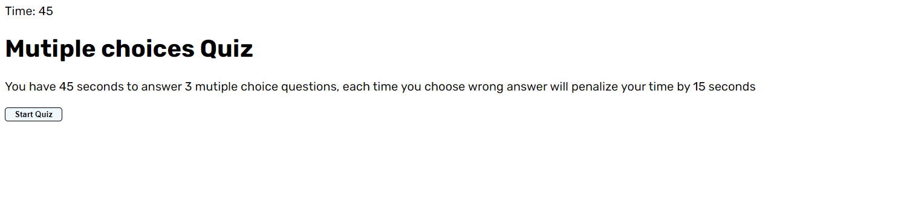
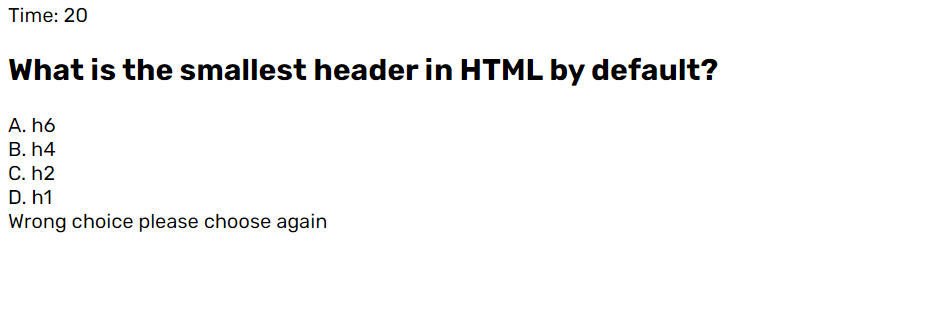
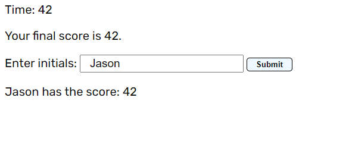

# quizz

DESCTIPTION:

For this quizz, user have 3 questions to answer

Everytime user choose wrong, time minuses 15 seconds and user has to choose again

Quizz sends message if user choose wrong

If user choose right, user go to the next question

Quizz end when user pass all the questions or user run out of time

Quizz saves name and score of user.

SCREENSHOT:

URL:

https://github.com/nathannguyen0102/quizz

https://nathannguyen0102.github.io/quizz/
